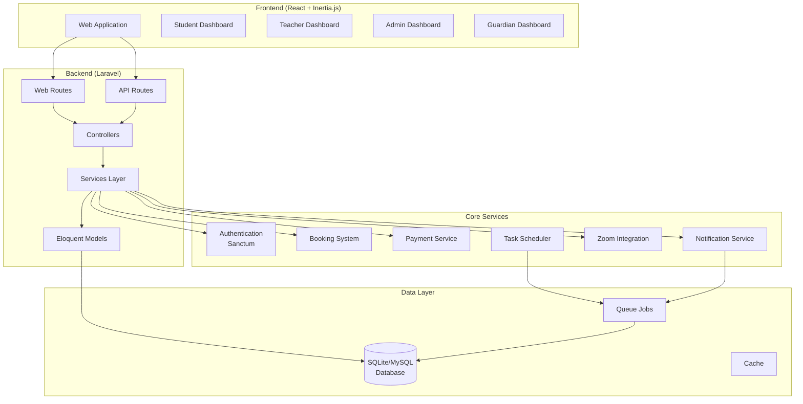

# WARP.md

This file provides guidance to WARP (warp.dev) when working with code in this repository.

## Project Overview

IQRAPATH is a comprehensive Islamic education platform built with Laravel 12.x and React 19. The system facilitates online Islamic education through a multi-role architecture supporting students, teachers, guardians, and administrators. Key features include live video sessions with Zoom integration, subscription management, booking systems, financial wallets, progress tracking, and comprehensive notification systems.

## Technology Stack

### Backend
- **Framework**: Laravel 12.x (PHP 8.2+)
- **Database**: SQLite (default), MySQL/PostgreSQL supported
- **Authentication**: Laravel Sanctum
- **Queue**: Database queue driver
- **WebSocket**: Laravel Reverb for real-time features
- **Task Scheduling**: Laravel Scheduler

### Frontend
- **Framework**: React 19 with TypeScript
- **Router**: Inertia.js v2 for SPA experience
- **UI Library**: Radix UI with shadcn/ui components
- **Styling**: Tailwind CSS v4
- **State Management**: React hooks, Inertia page props
- **Forms**: React Hook Form with Zod validation

### Development Tools
- **Build Tool**: Vite
- **Testing**: Pest (PHP), Jest/React Testing Library (JS)
- **Code Quality**: Laravel Pint, ESLint, Prettier
- **Package Managers**: Composer (PHP), npm (JS)

## Common Development Commands

### Initial Setup
```bash
# Clone and setup
git clone <repository-url>
cd IQRAPATH-final
composer install
npm install
cp .env.example .env
php artisan key:generate
php artisan migrate
php artisan db:seed
```

### Development Server
```bash
# Start all development services (recommended)
composer run dev
# This runs: Laravel server, queue worker, Vite dev server

# Or start services individually
php artisan serve                    # Laravel server (port 8000)
npm run dev                         # Vite dev server (port 5173)
php artisan queue:listen            # Queue worker
php artisan schedule:work           # Task scheduler
```

### Building and Assets
```bash
npm run build                       # Production build
npm run build:ssr                  # Build with SSR support
npm run format                     # Format code
npm run format:check               # Check formatting
npm run lint                       # Lint and fix
npm run types                      # TypeScript type checking
```

### Database Operations
```bash
php artisan migrate                 # Run migrations
php artisan migrate:fresh --seed   # Fresh database with seeds
php artisan migrate:rollback        # Rollback last migration
php artisan db:seed                 # Run seeders
```

### Testing
```bash
composer test                       # Run PHP tests (Pest)
php artisan test                   # Alternative test command
php artisan test --filter TestName # Run specific test
```

### Queue and Background Tasks
```bash
php artisan queue:listen            # Process queue jobs
php artisan schedule:work           # Run scheduled tasks
php artisan app:send-session-reminders  # Manual reminder execution
```

### Code Quality
```bash
./vendor/bin/pint                   # Format PHP code
npm run lint                        # Lint JS/TS code
npm run format                      # Format JS/TS code
```

## System Architecture



## Multi-Role User System

The platform supports five distinct user roles:

### 1. Students
- Profile management with learning preferences and progress tracking
- Session booking and attendance
- Progress monitoring with milestones and certificates
- Subscription management
- Wallet system for payments

### 2. Teachers
- Availability management and session scheduling
- Verification system with document upload and video calls
- Earnings and payout management
- Student progress tracking
- Zoom integration for virtual sessions

### 3. Guardians (Parents)
- Multiple children management
- Child registration and profile setup
- Direct messaging with teachers and staff
- Payment management for children's subscriptions

### 4. Administrators
- User management and verification
- Content management (FAQs, pages)
- Financial oversight and payout processing
- Notification system management
- System settings and configuration

### 5. Super Administrators
- Complete system access
- Admin role management
- System-wide settings and maintenance

## Key Business Logic Services

### NotificationService
Centralized notification management supporting:
- Multi-channel delivery (in-app, email, SMS)
- Template-based notifications with placeholders
- Event-driven automatic notifications
- Scheduled notification processing

### FinancialService
Handles all financial operations:
- Teacher earnings and wallet management
- Student payment processing
- Payout request management
- Transaction history and reporting

### ZoomService
Integration with Zoom for virtual sessions:
- Automatic meeting creation
- Webhook handling for attendance tracking
- Session recording management

### SubscriptionService
Manages subscription lifecycle:
- Plan creation and management
- Payment processing
- Auto-renewal handling
- Usage tracking

## Database Architecture

The system uses a comprehensive database schema with 50+ tables organized around key domains:

### User Management
- `users` - Base user table with role-based access
- `student_profiles`, `teacher_profiles`, `guardian_profiles`, `admin_profiles`

### Booking & Sessions
- `teacher_availabilities` - Teacher schedule management
- `bookings` - Session booking workflow
- `teaching_sessions` - Actual session execution
- `session_materials`, `session_progress` - Learning resources and tracking

### Financial System
- `student_wallets`, `teacher_wallets`, `guardian_wallets` - Multi-wallet system
- `transactions`, `wallet_transactions` - Transaction tracking
- `payout_requests` - Teacher payout management

### Subscription Management
- `subscription_plans` - Available subscription tiers
- `subscriptions` - User subscription tracking
- `subscription_transactions` - Payment history

### Notification System
- `notifications` - Notification content and metadata
- `notification_recipients` - Delivery tracking
- `notification_templates`, `notification_triggers` - Template system

### Verification System
- `verification_requests` - Teacher verification workflow
- `verification_calls` - Video verification sessions
- `verification_audit_logs` - Audit trail

## Scheduled Tasks

The system runs several background tasks via Laravel Scheduler:

```php
// Process scheduled support ticket responses
$schedule->command('app:process-scheduled-responses')
    ->everyFiveMinutes();

// Send session reminders
$schedule->command('app:send-session-reminders')
    ->dailyAt('08:00');

// Maintain WebSocket server
$schedule->command('app:start-reverb --background')
    ->everyFiveMinutes();

// Update urgent action counts
$schedule->job(new \App\Jobs\UpdateUrgentActionCounts())
    ->everyFiveMinutes();
```

### Testing Scheduler
Use the provided test scripts to verify scheduler functionality:
- Windows: `test-scheduler.bat`
- Linux/Mac: `./test-scheduler.sh`

## Frontend Architecture

### Page Structure
```
resources/js/pages/
├── admin/           # Admin dashboard and management
├── auth/            # Authentication pages
├── guardian/        # Guardian/parent interface
├── student/         # Student dashboard
├── teacher/         # Teacher dashboard
├── settings/        # System settings
└── messages/        # Messaging system
```

### Component Organization
```
resources/js/components/
├── ui/              # Reusable UI components (shadcn/ui)
├── forms/           # Form components with validation
└── common/          # Shared business logic components
```

### State Management
- **Page Props**: Inertia.js provides data from server
- **Form State**: React Hook Form for form management
- **UI State**: Local React state with hooks
- **Real-time**: Laravel Echo for WebSocket connections

## Development Guidelines (from Cursor Rules)

### Code Standards
- **PHP**: Follow PSR-12 standards, use strict types
- **TypeScript**: Enable strict mode, use proper typing
- **Components**: Functional components with hooks
- **Validation**: FormRequest classes (PHP), Zod schemas (TS)

### Architecture Patterns
- **Backend**: Service layer pattern, Eloquent ORM
- **Frontend**: Component composition, custom hooks
- **Integration**: Inertia.js for seamless SPA experience
- **Styling**: Tailwind utility classes, shadcn/ui components

### Testing Approach
- **Backend**: Pest for feature and unit tests
- **Frontend**: Jest and React Testing Library
- **E2E**: Laravel Dusk for browser testing
- **Database**: RefreshDatabase trait for test isolation

## Environment Configuration

### Required Environment Variables
```env
APP_NAME='IQRAPATH'
APP_URL=http://localhost
DB_CONNECTION=sqlite
QUEUE_CONNECTION=database
BROADCAST_CONNECTION=reverb

# Zoom Integration (optional)
ZOOM_API_KEY=your_zoom_api_key
ZOOM_API_SECRET=your_zoom_api_secret

# Mail Configuration
MAIL_MAILER=log  # or smtp for production
MAIL_FROM_ADDRESS="noreply@iqrapath.com"
```

### Development vs Production
- **Development**: SQLite database, log-based mail, local filesystem
- **Production**: MySQL/PostgreSQL, SMTP mail, cloud storage, Redis cache

## API Integration

### Authentication
- Uses Laravel Sanctum for SPA authentication
- Session-based authentication via cookies
- CSRF protection handled automatically by Inertia.js

### Route Organization
```php
// Web routes (Inertia pages)
routes/web.php        // Public pages
routes/dashboard.php  // User dashboards
routes/admin.php      // Admin routes
routes/teacher.php    // Teacher-specific routes

// API routes
routes/api.php        // API endpoints
```

### Data Flow
1. **User Action** → Frontend form/button
2. **Inertia Request** → Laravel route
3. **Controller** → Service layer
4. **Service** → Model/Database
5. **Response** → Inertia JSON response
6. **Frontend Update** → React re-render

## Troubleshooting Common Issues

### Scheduler Not Running
```bash
# Check if scheduler is working
php artisan schedule:list

# Run scheduler manually
php artisan schedule:run

# Check logs
tail -f storage/logs/laravel.log
```

### Queue Jobs Failing
```bash
# Restart queue worker
php artisan queue:restart

# Check failed jobs
php artisan queue:failed
```

### Asset Compilation Issues
```bash
# Clear caches
php artisan config:clear
php artisan route:clear
php artisan view:clear

# Rebuild assets
npm run build
```

### WebSocket Connection Issues
```bash
# Start Reverb server
php artisan reverb:start

# Check WebSocket status
php artisan reverb:restart
```

This documentation provides the essential information needed to work effectively with the IQRAPATH platform. The system's modular architecture and comprehensive business logic make it well-suited for scaling Islamic education services while maintaining code quality and developer productivity.
